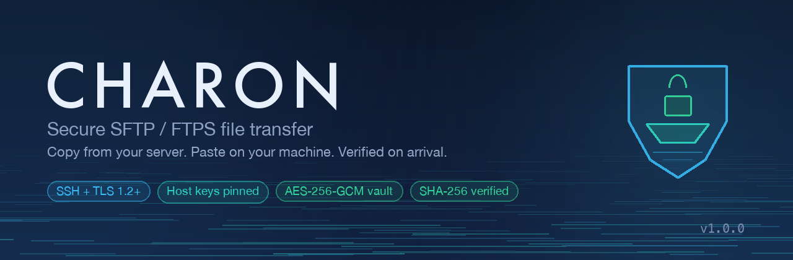
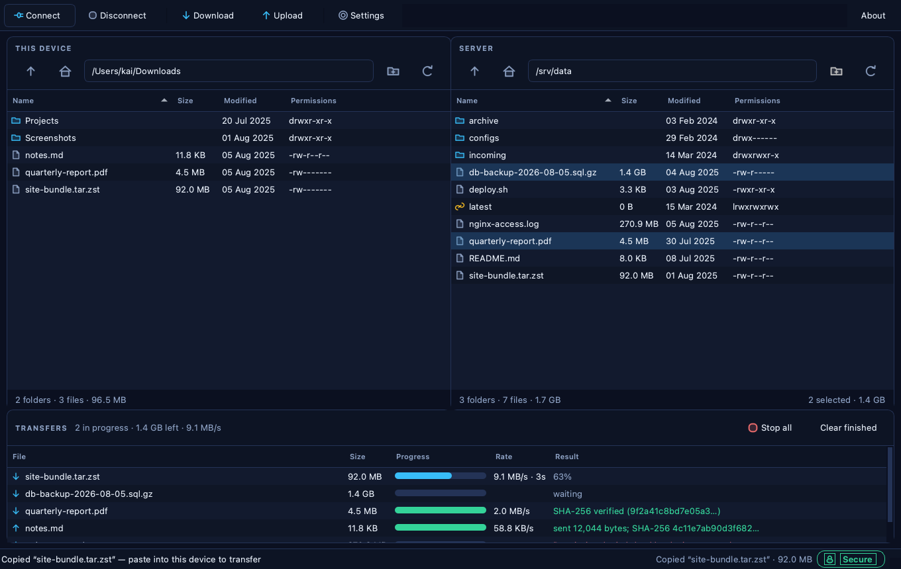
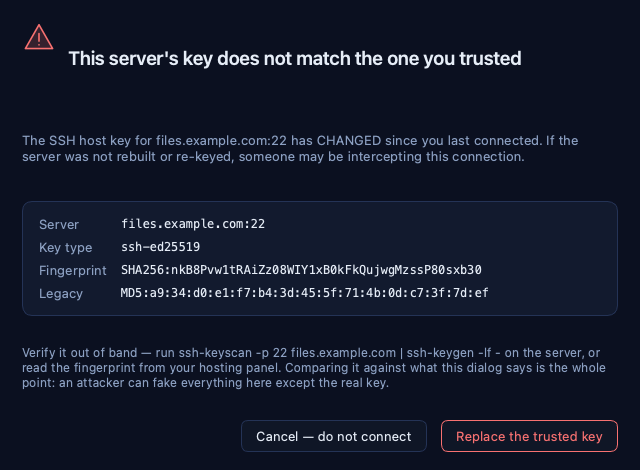
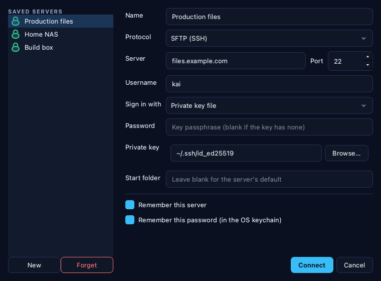
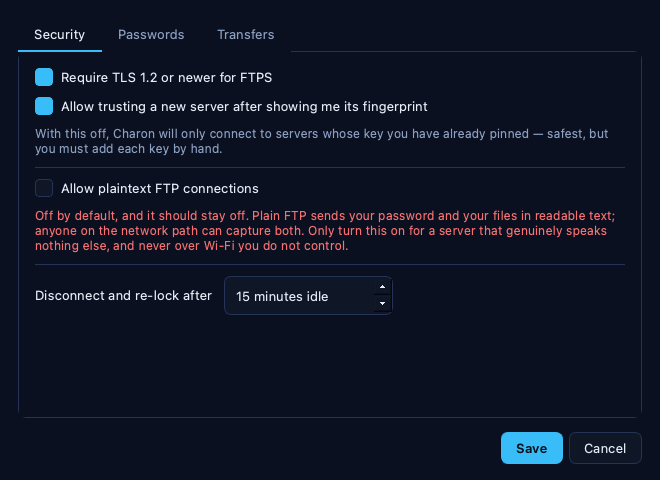
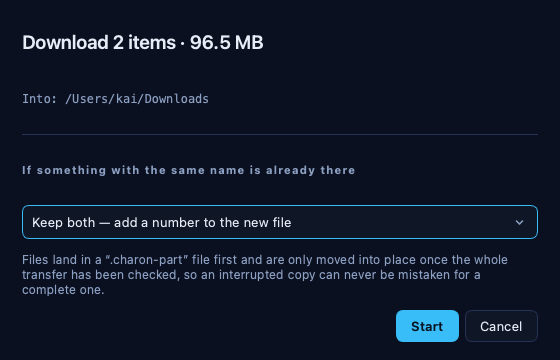
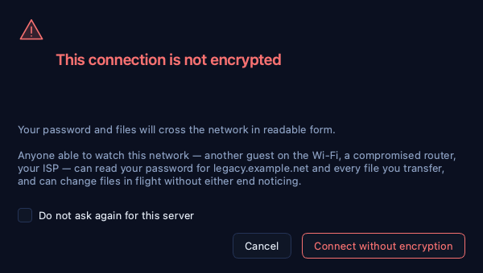

<div align="center">



**Copy from your server. Paste on your machine. Verified on arrival.**

[](https://github.com/at0m-b0mb/Charon/actions/workflows/ci.yml)
[](#installation)
[](https://www.python.org)
[](https://www.riverbankcomputing.com/software/pyqt/)
[](#tests)
[](LICENSE)
[](#no-telemetry)

</div>

---

## What it is

A file-transfer client for **SFTP** and **FTPS** that behaves the way you already
expect a file manager to behave — select, `Ctrl+C`, `Ctrl+V` — and is strict
about security in the places where it actually matters.

Two panes: your machine on the left, the server on the right. Copy on one side,
paste on the other, and the transfer starts. Drag and drop works too, in both
directions and from your OS file manager.

The interesting part is what happens underneath.

<div align="center">

</div>

---

## Why another FTP client

Most of them get one of these wrong.

**A padlock that isn't a padlock.** FTPS encrypts the *commands* with `AUTH TLS`.
Your *files* stay in the clear until `PROT P` is negotiated. Charon issues it and
**hangs up if the server refuses** — a session whose data channel is unencrypted
is never shown as secure, no matter how good the control channel looks.

**Accepting any host key.** The standard Python SFTP recipe uses paramiko's
`AutoAddPolicy`, which accepts whatever key answers the connection. That turns
SSH into encryption without authentication. Charon checks the host key **before
sending your password**, and there is a test that asserts the server never saw an
authentication attempt when the key was unknown.

**"Warning: host key changed. [Continue]".** A changed key on a server you didn't
just rebuild is the signature of an interception attack. Charon's dialog is red,
the button says what it does, and Cancel is the default.

**Trusting a directory listing.** A hostile server can name a file
`../../../../etc/cron.d/backdoor`. Every remote name is reduced to a single safe
component before it touches your filesystem, and the final path is re-checked
against your download folder afterwards.

**Half-downloaded files that look complete.** Bytes land in a `.charon-part`
sidecar and are moved into place only after the transfer verifies.

**A green tick that means "we assume so".** Charon hashes every byte it writes.
When the server can hash too, the two are compared and a mismatch discards the
file. When it can't — OpenSSH can't — it says *"size verified; SHA-256 … (server
offers no hash)"* instead of pretending.

---

## Features

### Transfers
- **Copy and paste** between panes — `Ctrl+C` / `Ctrl+V` (`⌘C` / `⌘V` on macOS)
- **Drag and drop** in both directions, and from your OS file manager
- Recursive folder transfer, queued with per-file progress, rate and ETA
- **Resume** interrupted transfers from the `.charon-part` sidecar
- Conflict handling that defaults to *keep both* — nothing is overwritten by accident
- Cancel individual transfers or the whole queue; browsing stays responsive
  throughout, because transfers run on their own connection

### Security
- **SFTP** over SSH, and **FTPS** over explicit TLS (`AUTH TLS` + `PROT P`)
- Host keys and TLS certificates **pinned on first use**, in an OpenSSH-compatible
  `known_hosts` file
- Weak algorithms refused outright: CBC modes, 3DES, RC4, MD5 and truncated MACs,
  SHA-1 key exchanges. TLS 1.2 floor for FTPS
- The status-bar badge reports what was **actually negotiated**, with the cipher,
  key exchange and fingerprint one click away
- **Plain FTP is off by default** and takes a deliberate switch to enable
- SSH keys (Ed25519 / ECDSA / RSA), encrypted keys, and **ssh-agent**
- Passwords in the **OS keychain** or an **AES-256-GCM vault** (scrypt, N=2¹⁶)
- Downloads written `0600`; config directory `0700`
- Idle sessions disconnect and re-lock the vault automatically

<div align="center">

<br/><em>What a suspected interception looks like. Cancel is the default button.</em>
</div>

---

## Installation

Charon runs on **Windows, macOS and Linux**. It needs Python 3.10 or newer.

```bash
git clone https://github.com/at0m-b0mb/Charon.git
```

```bash
cd Charon && python3 -m venv .venv && .venv/bin/pip install -r requirements.txt
```

```bash
.venv/bin/python run.py
```

<details>
<summary>Windows</summary>

```powershell
cd Charon
py -m venv .venv
.venv\Scripts\pip install -r requirements.txt
.venv\Scripts\python run.py
```
</details>

<details>
<summary>Linux notes</summary>

PyQt6 needs the usual X11/Wayland runtime libraries. On Debian/Ubuntu:

```bash
sudo apt install libxcb-cursor0 libxkbcommon-x11-0
```

For the keychain backend, install `gnome-keyring` or `kwallet`. Without one,
choose the encrypted vault in Settings → Passwords — Charon detects the absence
and greys the keychain option out rather than failing at first use.
</details>

<details>
<summary>Install as a command</summary>

```bash
.venv/bin/pip install .
```

Then run `charon` from anywhere.
</details>

---

## Using it

**Connect.** `Ctrl+N`, or the Connect button. Pick SFTP or FTPS, fill in the
host and username, choose password / key file / ssh-agent. On a first connection
you are shown the server's fingerprint — check it against the server before
approving:

```bash
ssh-keyscan -p 22 your.server.com | ssh-keygen -lf -
```

**Transfer.** Select files in either pane and press `Ctrl+C`, then click the other
pane and press `Ctrl+V`. Or drag them across. Or select and hit the Download /
Upload buttons. All three do the same thing.

**Check.** The badge in the bottom-right is green only when the connection is
encrypted *and* the server's identity is confirmed. Click it for the cipher, key
exchange and fingerprint. The Result column in the transfer queue tells you
exactly what was verified for each file.

| | |
|---|---|
|  |  |
| Saved servers, with the auth method per site | Security policy — plain FTP is off by default |
|  |  |
| Paste, with the conflict rule up front | What you see before an unencrypted connection |

---

## Where things are kept

| Platform | Location |
|---|---|
| macOS | `~/Library/Application Support/Charon/` |
| Linux | `~/.config/charon/` |
| Windows | `%APPDATA%\Charon\` |

Containing `sites.json` (no secrets), `settings.json`, `known_hosts`
(OpenSSH-compatible), `pinned_certs.json`, `vault.charon` if you use the vault,
and `charon.log`. Run `python run.py --where` to print the path.

The directory is created `0700`. Delete it to reset Charon completely.

---

## Tests

131 tests, including **12 that run against a real SSH server started in-process**
— a genuine socket, handshake and SFTP channel, with no mocking of paramiko.
That is the only way to prove that the host key is really checked before the
password is sent, rather than merely intended to be.

```bash
.venv/bin/python -m pytest
```

The security-critical suites are `test_safety.py` (hostile filenames),
`test_vault.py` (tampering and KDF downgrade), `test_trust.py` (pinning), and
`test_sftp_live.py` (the wire).

---

## No telemetry

Charon makes no network connection other than to the servers you tell it to
connect to. No update check, no analytics, no crash reporting. The log is plain
text in the config directory and contains no secrets, so you can verify that
claim yourself.

---

## Security

The threat model, the design decisions and their reasoning are in
[SECURITY.md](SECURITY.md). Vulnerability reports go to
[GitHub security advisories](https://github.com/at0m-b0mb/Charon/security/advisories/new).

Charon protects the transfer — your credentials, the bytes on the wire, and the
files as they land. It cannot help you if your own machine or the server is
already compromised.

## Licence

MIT — see [LICENSE](LICENSE).

<div align="center">
<sub>Built by <a href="https://github.com/at0m-b0mb">at0m-b0mb</a>. Charon ferried
what you gave him across the river, and he took nothing else.</sub>
</div>
